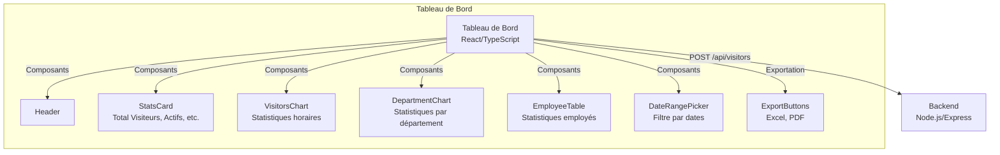

# Projet Avatar IA Interactif - Tableau de Bord


## 📖 Description

Ce dépôt contient le code source du **tableau de bord** pour le projet **Avatar IA Interactif pour Accueil Intelligent**. Ce tableau de bord, développé en **React** et **TypeScript**, fournit une interface utilisateur pour visualiser et analyser les données des visiteurs en temps réel. Il s’intègre avec le backend [](https://github.com/Abirgharbi/final-virtual-avatar-backend) via l’endpoint `/api/visitors` pour récupérer les statistiques des visites, afficher des graphiques, et permettre l’exportation des données en formats Excel et PDF.

Le tableau de bord affiche des métriques clés (nombre total de visiteurs, visiteurs actifs, heure de pointe, durée moyenne des visites, etc.), des graphiques (par heure et par département), et une table des employés. Il permet également de filtrer les données par plage de dates et d’exporter les résultats pour un suivi administratif.

## 🎯 Objectifs du Projet

- **Visualisation** : Afficher des statistiques en temps réel sur les visiteurs, employés, et départements.
- **Analyse** : Fournir des graphiques et métriques pour identifier les tendances (heures de pointe, départements populaires).
- **Exportation** : Générer des rapports en Excel et PDF pour un suivi hors ligne.
- **Interactivité** : Permettre le filtrage des données par plage de dates.
- **Intégration** : Synchroniser avec le backend pour des données actualisées.

## 🏛️ Architecture



Explication :

- Le tableau de bord (React/TypeScript) envoie des requêtes POST à l’endpoint /api/visitors du backend pour récupérer les données.
- Les composants affichent les statistiques (StatsCard), graphiques (VisitorsChart, DepartmentChart), et une table (EmployeeTable).
- Le DateRangePicker permet de filtrer les données par plage de dates.
- Les ExportButtons utilisent XLSX pour l’export Excel et jsPDF/html2canvas pour l’export PDF.

## 🚀 Fonctionnalités Principales

### Visualisation des Statistiques
- **Métriques clés** : Affiche le nombre total de visiteurs, les visiteurs actifs, l’heure de pointe, la durée moyenne des visites, le top employé, et le top département via `StatsCard`.
- **Graphiques** :
  - `VisitorsChart` : Statistiques horaires des visites.
  - `DepartmentChart` : Répartition des visites par département.
- **Tableau des employés** : Liste les employés avec leurs visites et départements via `EmployeeTable`.

### Filtrage et Interactivité
- **Filtre par plage de dates** : Utilise `DateRangePicker` pour sélectionner une période (par défaut : août 2025).
- **Mise à jour en temps réel** : Récupère automatiquement les données actualisées du backend lors du changement de plage de dates.

### Exportation des Données
- **Export Excel** : Génère un fichier `.xlsx` avec les données des visites (nom, arrivée, départ, motif, contact) et statistiques globales via `exportToExcel`.
- **Export PDF** : Capture le tableau de bord en PDF avec `jsPDF` et `html2canvas` via `exportToPDF`.

### Intégration
- **Backend** : Récupère les données via l’endpoint `/api/visitors` (JSON) avec des statistiques sur les visiteurs, employés, et départements.
- **Formats de données** : Utilise des interfaces TypeScript (`VisitorData`, `DashboardStats`, `HourlyStats`, etc.) pour une gestion rigoureuse des types.

## 🗂️ Structure du Projet

- **components/dashboard/** :
  - `StatsCard.tsx` : Affiche les cartes de statistiques (ex. total visiteurs, durée moyenne).
  - `VisitorsChart.tsx` : Graphique des visites par heure.
  - `DepartmentChart.tsx` : Graphique des visites par département.
  - `EmployeeTable.tsx` : Tableau des statistiques des employés.
  - `ExportButtons.tsx` : Boutons pour exporter en Excel et PDF.
  - `DateRangePicker.tsx` : Composant pour filtrer par plage de dates.
- **components/layout/** :
  - `Header.tsx` : En-tête du tableau de bord.
- **types/** :
  - `dashboard.ts` : Interfaces TypeScript pour les données (`VisitorData`, `DashboardStats`, `HourlyStats`, etc.).
- **utils/** :
  - `exportUtils.ts` : Fonctions pour l’exportation (`exportToExcel`, `exportToPDF`) et le formatage (`formatDuration`, `formatNumber`).
- **pages/** :
  - `Index.tsx` : Page principale du tableau de bord, orchestrant les composants et la logique de récupération des données.

## 🛠️ Technologies Utilisées

- **Framework** : React 18.x, TypeScript 5.x
- **Styling** : TailwindCSS 3.x
- **Icônes** : Lucide-React
- **Exportation** :
  - XLSX pour l’export Excel
  - jsPDF et html2canvas pour l’export PDF
- **Autres** :
  - Fetch API pour les requêtes HTTP
  - Intl.NumberFormat pour le formatage des nombres
  - Date API pour la gestion des plages de dates

## 📦 Installation

1. Clonez le dépôt :
```bash
git clone https://github.com/Abirgharbi/Prologic_Dashboard.git
cd Prologic_Dashboard
```

2. Installez les dépendances :
```bash
npm install
```

## 🚀 Usage

1. Lancez le serveur de développement :
```bash
npm run dev 
```
2. Testez les fonctionnalités :

- Modifiez la plage de dates avec DateRangePicker et vérifiez les mises à jour des graphiques.
- Exportez les données en Excel ou PDF via ExportButtons.
- Vérifiez les statistiques affichées dans StatsCard, VisitorsChart, et EmployeeTable.

3. Assurez-vous que le backend est en cours d’exécution :

- Le tableau de bord envoie des requêtes à http://localhost:3000/api/visitors.
- Lancez le backend  avant de tester.

## 📋 Guide
- Statistiques : Vérifiez les métriques dans StatsCard (total visiteurs, visiteurs actifs, heure de pointe, etc.).
- Graphiques : Testez VisitorsChart et DepartmentChart pour confirmer la répartition des visites par heure et département.
- Filtre par dates : Modifiez la plage de dates via DateRangePicker et confirmez la mise à jour des données.
- Exportation :
  * Testez l’export Excel (ExportButtons) pour vérifier le contenu du fichier .xlsx.
  * Testez l’export PDF pour confirmer que le tableau de bord est correctement capturé.

